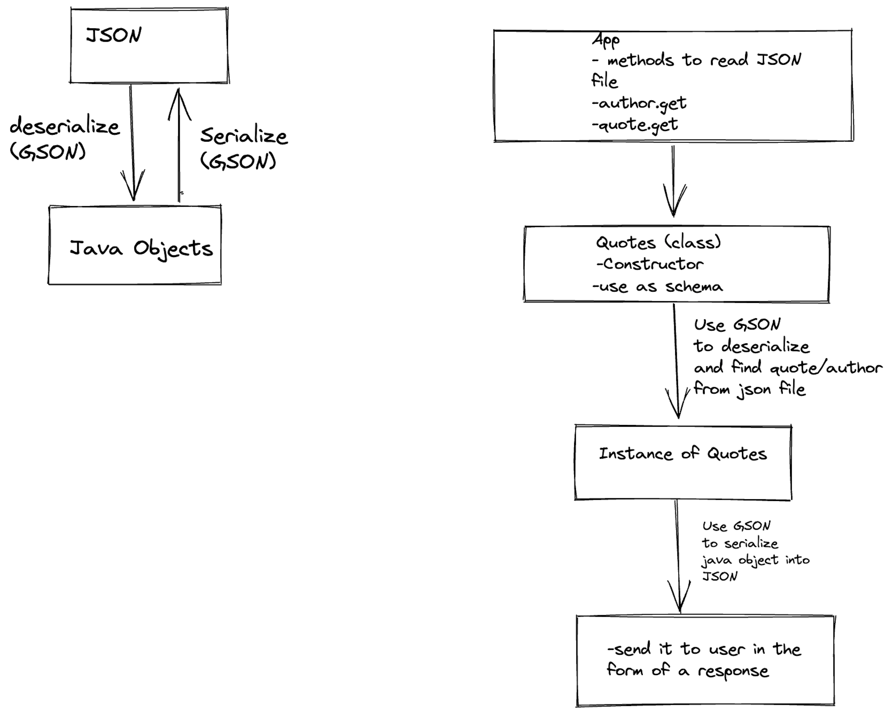

# Quotes

Prints a quote from a json file or a description from PokeAPI

## Directions for user

Use `./gradlew run --args "args"` to run the application. For `args[0]` use `author` to search by author, `contains` to search a quote with a given word, `random` for a random quote, and `pokemon` to receive a random Pokemon's description.

### For example:

To obtain a quote by George Orwell;

    ./gradlew run --args "author George Orwell"

a quote with the word "world";

    ./gradlew run --args "contains world"

for a random quote;

    ./gradlew run --args "random"

for a random Pokemon description;

    ./gradlew run --args "pokemon"

## Domain Modeling

